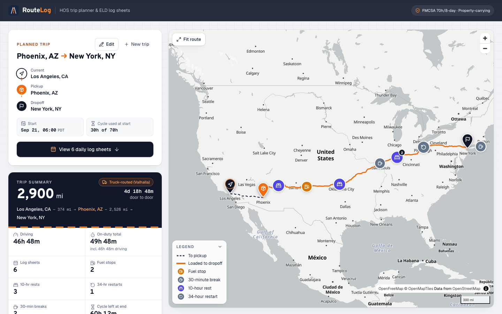
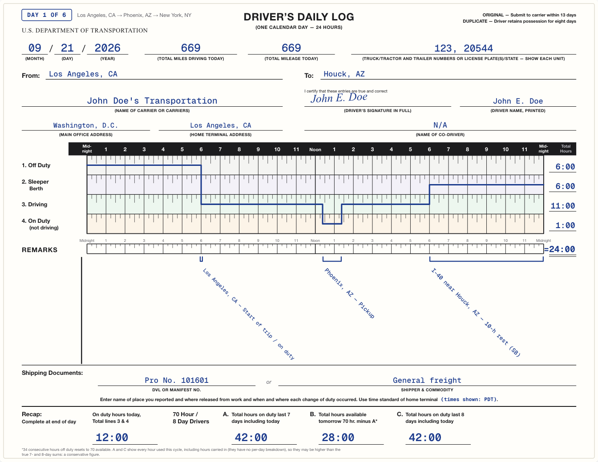
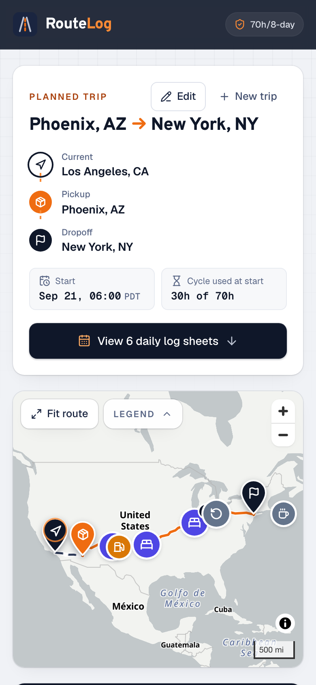
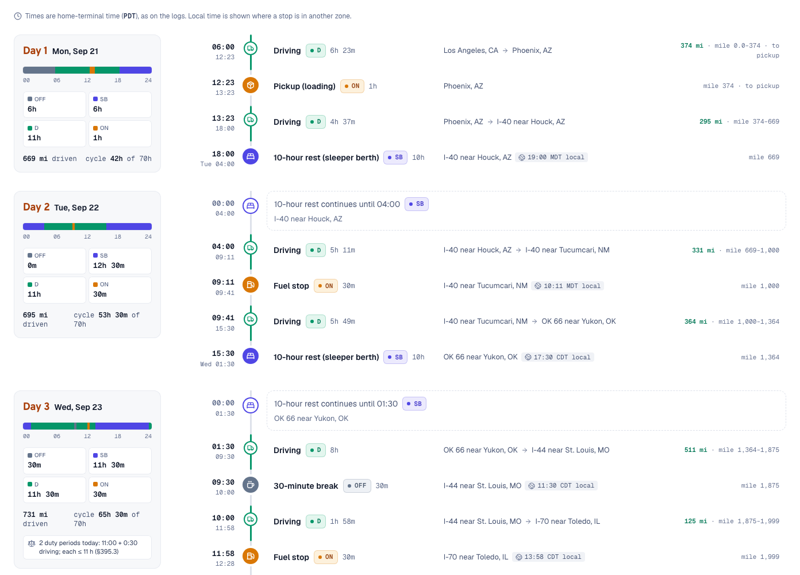
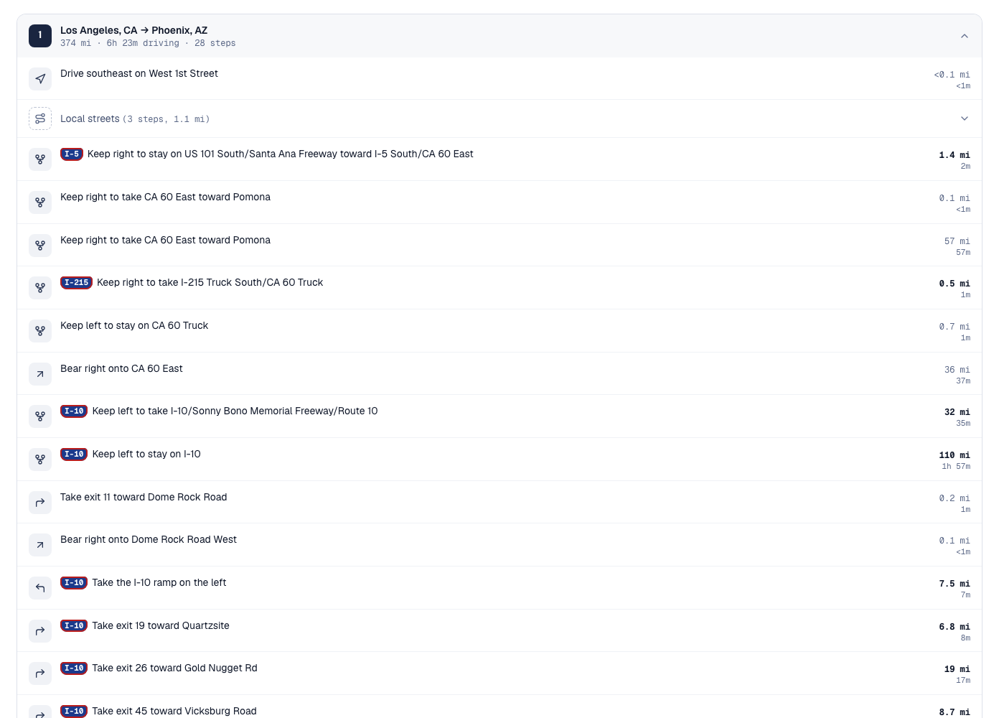
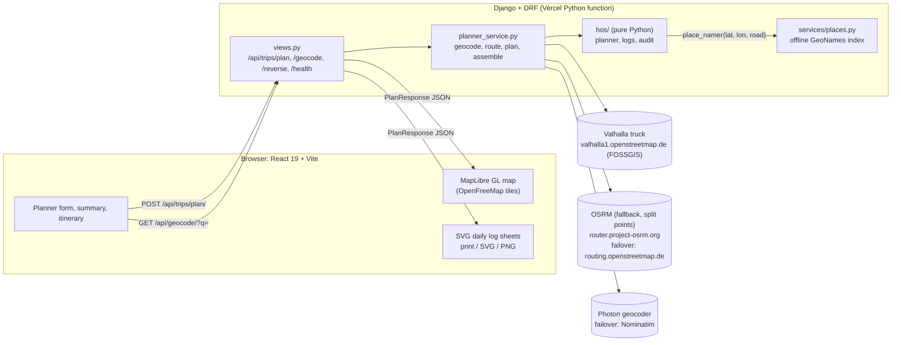

# RouteLog: ELD Trip Planner

**Enter a current location, a pickup, a drop-off and the hours already used in the cycle. RouteLog plans an FMCSA-compliant trip and returns the route map, every required stop, and a filled-out driver's daily log for each calendar day.**

- **Live app:** https://routelog-eld.vercel.app (add `?demo=1` to open a recorded trip that needs no backend)
- **API:** https://eld-trip-planner-api-ten.vercel.app/api/health/
- **Loom walkthrough:** _link to be added_



| Daily log sheet (day 1 of 6: start, pickup, 10-hour rest) | Mobile |
|---|---|
|  |  |

| Itinerary grouped by day | Turn-by-turn directions |
|---|---|
|  |  |

---

## Contents

- [Features](#features)
- [How the HOS engine works](#how-the-hos-engine-works)
- [Architecture](#architecture)
- [API reference](#api-reference)
- [Project structure](#project-structure)
- [Local setup](#local-setup)
- [Testing](#testing)
- [Deployment](#deployment)
- [Security and abuse protection](#security-and-abuse-protection)
- [Limitations and future work](#limitations-and-future-work)
- [Credits](#credits)

## Features

**Planning**
- Location autocomplete for the US and Canada, with keyboard navigation, "Use my location", and a button to swap pickup and drop-off.
- A Current Cycle Used input with a number field, a 0-70 slider, and a line showing the hours left.
- A start date and time in home-terminal time (defaults to the next 08:00, so a trip planned in the evening does not start with an overnight drive), plus advanced options: pre-/post-trip inspections (off by default), whether 10-hour rests are logged as sleeper berth or off duty, and the fuel-stop length.
- Three example trips: a short haul, a cross-country run, and a trip close to the cycle limit that triggers a 34-hour restart.
- **Share links.** Every plan writes its request to the URL (`?from=Chicago,%20IL@41.8781,-87.6298&pickup=…&to=…&cycle=10&start=2026-09-21T06:00`). Reload, Back and Forward restore it from a session cache without re-planning, Back from the results returns to the form, and "Copy share link" copies a link that re-plans the same trip anywhere.

**Results**
- **Truck routing.** Routes come from [Valhalla](https://valhalla.github.io/valhalla/)'s `truck` profile (truck-legal roads and truck speeds) on the FOSSGIS public server, so the trip follows interstates and truck routes. If Valhalla is unavailable the backend falls back to OSRM's car network, marks the route "Car network (OSRM fallback)" and says so in the warnings. It does the same when the truck route detours far beyond the car route (for example where OpenStreetMap marks a border crossing truck-restricted), and the warning gives the detour.
- A MapLibre map. The drive to pickup and the loaded leg are drawn in different styles. Pins mark each stop (fuel, 30-minute break, 10-hour rest, 34-hour restart, pickup, drop-off, inspections) with a popup for its time window, duration, place and mile marker. Clicking an itinerary row flies the map to that stop.
- A trip summary with a routing badge ("Truck-routed (Valhalla)"): total miles, driving and on-duty hours, trip length, log-sheet count, fuel stops, rests and restarts, cycle hours left at arrival, and a duty-status timeline bar for the whole trip.
- An itinerary grouped by calendar day, with per-day totals by duty status. Times are home-terminal time, as on the logs; each stop in another zone also shows its **local time** ("08:19 EDT local"), and a pickup or drop-off between 22:00 and 05:00 local gets an "Outside typical dock hours" chip. A day that holds two duty periods with more than 11:00 of driving in total is explained on the day card and the sheet ("2 duty periods today: 11:00 + 0:45 driving; each ≤ 11 h").
- **Daily Logs:** one FMCSA-style sheet per calendar day, drawn in SVG. Each sheet has the 24-hour grid and duty line, row totals that add up to 24, remarks brackets naming the city and state (and the highway for a stop outside a city), and the 70-hour/8-day recap (A, B and C). Header fields (driver, carrier, truck and trailer numbers, shipping document) are saved in the browser. Sheets can be printed or saved as PDF (one landscape page per sheet), or downloaded as SVG or PNG.
- **Directions:** turn-by-turn steps per leg, written in English by our own generator from the Valhalla maneuvers (or OSRM's on the fallback). Runs of city streets before the first and after the last interstate are folded into a "Local streets" row.
- The layout is responsive down to phone width. It has skeleton loading states, error messages that say what went wrong, visible focus rings and 44 px touch targets.

## How the HOS engine works

The engine is pure Python in [`backend/trips/hos/`](backend/trips/hos). It does no I/O and imports nothing from Django. It simulates the trip minute by minute in integer minutes, so every daily log adds up to exactly 1,440 minutes.

### Rules modelled

These apply to a property-carrying driver on the 70-hour/8-day cycle with no adverse driving conditions. Constants are in [`rules.py`](backend/trips/hos/rules.py). Page numbers refer to the [FMCSA *Interstate Truck Driver's Guide to Hours of Service* (April 2022)](https://www.fmcsa.dot.gov/sites/fmcsa.dot.gov/files/2022-04/FMCSA-HOS-395-DRIVERS-GUIDE-TO-HOS(2022-04-28)_0.pdf).

| Rule | Limit | How the planner handles it | Source |
|---|---|---|---|
| 11-hour driving limit | 11 h driving per duty period | Takes a 10-hour rest | p.6 |
| 14-hour window | No driving after the 14th hour since coming on duty. Off-duty time inside the window does not pause it. | Takes a 10-hour rest | p.6-7 |
| 30-minute break | A 30-minute break is required after 8 h of cumulative driving. Any 30 consecutive non-driving minutes count. | Takes a 30-minute off-duty break. Any 30 consecutive non-driving minutes (a pickup, a drop-off, a 30-minute pre-trip, or a fuel stop of 30 minutes or more) also reset the 8-hour clock. | p.6, p.10 |
| 10-hour reset | 10 consecutive hours off duty or in the sleeper berth | Resets the 11- and 14-hour clocks. Logged as sleeper berth by default. | p.6-7 |
| 70-hour/8-day cycle | No driving at or above 70 h on duty (driving plus on duty not driving) | Takes a 34-hour restart, placed where it gives the earliest arrival (below) | p.10-11 |
| 34-hour restart | 34 consecutive hours off duty | Resets the cycle to 0. Logged as off duty. A restart at the trip start counts the time off since midnight, so for an 08:00 start it lasts 26 h. | p.11 |
| Fuel | At least every 1,000 miles (assessment brief) | 30 min on duty by default. Fuel due within 75 miles is taken at a rest or break that is happening anyway, and fuel due in the first 3 h of the next duty period is taken before the rest, as long as that adds no fuel stop. | brief |
| Pickup and drop-off | 1 hour each (assessment brief) | Logged on duty, not driving. Loading counts as on-duty time (p.5). | brief, p.5 |
| Inspections | Optional, off by default (the brief lists only pickup, drop-off and fuel as time costs) | When turned on: 30-min pre-trip at the start of each duty period, 15-min post-trip before each rest and after drop-off. Both are on duty (p.5). | p.5 |

On-duty work after the 14th hour or past 70 hours is legal. Only driving is blocked (p.9-10), so a drop-off can always be completed.

### Planning algorithm, in brief

[`planner.py`](backend/trips/hos/planner.py) drives leg 0 (current to pickup), does the pickup, drives leg 1 (pickup to drop-off), then does the drop-off. Inside a leg, each step of `_Planner._drive_step` checks these in priority order:

1. **Cycle exhausted:** a **34-hour restart** (after a post-trip inspection when inspections are on). Driving stops early enough that any post-trip inspection still ends within 70 hours.
2. **11 hours driven or 14-hour window closed:** a **10-hour rest** (after a post-trip inspection when inspections are on). If fuel falls due within the next 75 miles, or within the first 3 hours of the next duty period's driving, the driver fuels at the same stop. If the rest of the trip cannot fit in the cycle and the next duty period could drive less than an hour, the planner takes a 34-hour restart instead of a rest that would unlock no useful driving.
3. **8 hours driven since the last 30-minute interruption:** a **30-minute break**. If fuel is due, or due within 75 miles, and the fuel stop lasts at least 30 minutes, the fuel stop is the break. If less than 15 minutes of driving could follow the break, the planner ends the duty period instead.
4. **1,000 miles since the last fuel:** a **fuel stop**. As with the break, if almost no driving could follow it, the fuel, post-trip and rest happen at the same stop. A fuel stop shorter than 30 minutes is followed by the 30-minute break at the same place when the break is due within the hour.
5. **Otherwise, drive** until the first limit is reached: the 11-hour limit, the 14-hour window, the 8-hour break, the cycle, the fuel range, or the end of the leg.

**Where the 34-hour restart goes.** Restarting as late as possible often wastes a 10-hour rest right before the restart. Whenever the rest of the trip no longer fits in the cycle hours left but would fit in a fresh 70 hours, the planner marks an optional restart point: the trip start and every place a 10-hour rest is due. `plan_drives` plans the trip greedily, then once per marked point with the restart taken there, and keeps the earliest arrival (the greedy plan on a tie). Los Angeles → Phoenix → New York at 30 h used restarts in place of the first 10-hour rest and arrives 10 h 45 min earlier than rest-then-restart. The warnings say why the restart was needed and whether it is only needed because used hours are assumed not to roll off.

Each stop is placed at the exact point along the real truck route where its limit is reached. `LegProfile` ([`profile.py`](backend/trips/hos/profile.py)) interpolates distance, time and coordinates along the route shape (Valhalla maneuver times spread over their shape segments, or OSRM's per-segment annotations on the fallback). Speeds are capped at 65 mph for a truck. [`logs.py`](backend/trips/hos/logs.py) then splits the events at midnight into daily sheets. It merges duty segments, rounds row totals with a largest-remainder method so they sum to exactly 24.00, writes remarks named from an offline place index ("I 44 near Joplin, MO"), and fills in the 70-hour recap.

### Assumptions

The API returns these in `assumptions[]` and the UI lists them.

- The driver starts rested (at least 10 h off): the 11- and 14-hour clocks are fresh.
- The driver is off duty from midnight until the trip starts, and from the trip end until midnight.
- The tank is full at the current location.
- **Cycle hours do not roll off during the trip.** The input is one number with no per-day history, so the planner assumes none of it drops off. This is conservative: it may take a restart slightly earlier than a full log history would require (p.10-11).
- Log sheets use the home-terminal time zone of the start location for the whole trip, even across zones (p.16). The itinerary and map popups add each stop's local time.
- A 34-hour restart is taken when the rest of the trip's driving no longer fits in the cycle, at the trip start or in place of the 10-hour rest that gives the earliest arrival.
- One driver: no team driving and no split sleeper berth.
- Truck speed is at most 65 mph on any route segment.

## Architecture



- **Stateless API.** There are no models and no database. One plan request makes at most three geocoding calls (run in parallel), then routes with Valhalla. The public Valhalla server limits a request to 1,500 km of straight-line distance, so a longer leg is split on an interstate taken from the OSRM route of the same trip, routed in chunks and stitched back together; Valhalla calls run one at a time, 0.25 s apart. Any Valhalla failure falls back to OSRM for the whole trip. Every upstream call shares a time budget (`PLAN_TIME_BUDGET_SECONDS`, 25 s by default), and 8 s of it is always kept for the fallback.
- **Time zones offline.** Each place in the offline dataset carries its IANA zone, so stops get local times without an API call. `input.home_timezone` is the current location's zone.
- **Place names in remarks never hit the network.** `places.csv.gz` is about 23,000 US and Canadian populated places from GeoNames, loaded into a 1° grid index. Stops are labelled in log-remark style ("Joliet, IL", "I 80 near Joliet, IL") without calling a rate-limited reverse geocoder.
- **One JSON contract.** [`frontend/src/types/api.ts`](frontend/src/types/api.ts) defines the response shape. The backend emits exactly those snake_case keys, and a contract test checks this.
- **Offline demo.** `?demo=1` (Chicago → St. Louis → Dallas, 2 sheets) and `?demo=restart` (Seattle → Denver → Houston at 60 h used, with a 34-hour restart) replay responses recorded from the live backend through a lazily loaded mock client.

## API reference

All endpoints live under `/api/`. The trailing slash is optional. Planning is rate-limited to 20 requests/min per IP and autocomplete to 60/min; see [Security](#security-and-abuse-protection). Every error has the same shape: `{"error": "<message>", "code": "<code>", "details"?: {"<field>": ["..."]}}`.

### `POST /api/trips/plan/`

Request (each location takes either `lat`/`lon` or a free-text `query`; `start_time` is required, as `YYYY-MM-DDTHH:MM` in home-terminal time; `options` is optional and defaults to `include_inspections: false`, `rest_status: "SB"`, `fuel_stop_minutes: 30`):

```json
{
  "current_location": { "label": "Chicago, IL", "lat": 41.8781, "lon": -87.6298 },
  "pickup_location":  { "query": "St. Louis, MO" },
  "dropoff_location": { "query": "Dallas, TX" },
  "current_cycle_used_hours": 10,
  "start_time": "2026-09-21T06:00",
  "options": { "include_inspections": false, "rest_status": "SB", "fuel_stop_minutes": 30 }
}
```

Response (`PlanResponse`, abridged):

```jsonc
{
  "input":    { "current_location": { "label": "Chicago, IL", "lat": 41.8781, "lon": -87.6298 }, "...": "..." },
  "route":    { "distance_miles": 962.2, "duration_hours": 15.18, "geometry": [[-87.62977, 41.8781], "..."],
                "legs": [{ "from_role": "current", "to_role": "pickup", "distance_miles": 297.4,
                           "instructions": [{ "text": "Drive south on South Federal Street", "maneuver": "depart", "...": "..." }] }],
                "provider": "Valhalla truck (valhalla1.openstreetmap.de)", "truck_routing": true },
  "timeline": [{ "id": "e1", "kind": "drive", "status": "D", "label": "Driving",
                 "start": "2026-09-21T06:00", "end": "2026-09-21T10:44", "duration_hours": 4.73,
                 "miles": 297.4, "start_mile": 0.0, "end_mile": 297.4, "leg_index": 0,
                 "start_location": { "lat": 41.8781, "lon": -87.62977, "name": "Chicago, IL", "tz": "America/Chicago" },
                 "local_start": "2026-09-21T06:00", "start_tz_abbr": "CDT", "...": "..." }],
  "stops":    [{ "id": "e2", "kind": "pickup", "status": "ON", "label": "Pickup (loading)",
                 "start": "2026-09-21T10:44", "end": "2026-09-21T11:44", "mile_marker": 297.4, "day_number": 1,
                 "local_start": "2026-09-21T10:44", "local_tz_abbr": "CDT", "...": "..." }],
  "daily_logs": [{ "date": "2026-09-21", "day_number": 1, "total_miles": 694.1,
                   "segments": [{ "status": "OFF", "start_minute": 0, "end_minute": 360 }, "..."],
                   "totals": { "OFF": 6.0, "SB": 6.0, "D": 11.0, "ON": 1.0 },
                   "remarks": [{ "start_minute": 644, "end_minute": 704, "status": "ON", "location": "St. Louis, MO", "note": "Pickup" }],
                   "on_duty_hours": 12.0, "cycle_hours_used": 22.0, "cycle_hours_available": 48.0,
                   "from_location": "Chicago, IL", "to_location": "Malvern, AR" }],
  "summary":  { "total_miles": 962.2, "total_driving_hours": 15.17, "num_days": 2, "num_rests": 1,
                "num_restarts": 0, "cycle_hours_available_at_end": 42.83, "...": "..." },
  "assumptions": ["The driver starts the trip rested (at least 10 hours off), ...", "..."],
  "warnings": []
}
```

| Status | `code` | When |
|---|---|---|
| 400 | `validation_error` | Cycle hours outside 0-70, a missing or bad `start_time` (use `YYYY-MM-DDTHH:MM`), a location with neither coordinates nor a query, or a body that is not valid JSON |
| 413 | `payload_too_large` | The request body is over Django's upload size limit |
| 422 | `geocode_failed` | A free-text location has no US or Canadian match |
| 422 | `unsupported_region` | A location given by coordinates has no US or Canadian place within 150 miles |
| 422 | `route_not_found` | The points cannot be connected by road (for example, across an ocean) |
| 429 | `rate_limited` | Over the per-IP rate limit; the `Retry-After` header says how many seconds to wait |
| 502 | `upstream_unavailable` | Valhalla and both OSRM hosts failed, or the time budget ran out |

Any other path returns 404 `not_found`, and an unexpected server error returns 500 `internal_error`.

### `GET /api/geocode/?q=joliet`

Autocomplete, restricted to the US and Canada. `q` needs at least 2 characters; `limit` is optional (1-10, default 6). Results are cached in memory and sent with `Cache-Control: public, max-age=3600`.

```json
{ "results": [{ "label": "Joliet, Illinois, United States", "short_label": "Joliet, IL", "lat": 41.525, "lon": -88.0817 }] }
```

### `GET /api/reverse/?lat=41.52&lon=-88.08`

The nearest populated place from the offline dataset. Used by "Use my location". Returns `{"result": GeocodeResult | null}`.

### `GET /api/health/`

Returns `{"status": "ok"}`.

## Project structure

```
eld-trip-planner/
├── backend/                     Django 6.1 + DRF, managed with uv
│   ├── config/                  settings (env-driven), urls, wsgi (Vercel entrypoint)
│   ├── trips/
│   │   ├── hos/                 pure-Python HOS engine
│   │   │   ├── rules.py         limits and durations, with FMCSA page cites
│   │   │   ├── profile.py       LegProfile: mile/minute/coordinate interpolation along a leg
│   │   │   ├── planner.py       duty-status state machine (plan_events)
│   │   │   ├── logs.py          timeline, stops, daily logs, summary (build_plan)
│   │   │   └── audit.py         independent compliance checker used by the tests
│   │   ├── services/            Valhalla truck routing (valhalla.py) with OSRM fallback (routing.py),
│   │   │                        Photon/Nominatim geocoding, offline places and time zones,
│   │   │                        instruction text, polyline simplification, TTL cache
│   │   ├── data/places.csv.gz   GeoNames US/CA populated places
│   │   ├── planner_service.py   geocode → route → engine → PlanResponse
│   │   ├── serializers.py       request validation
│   │   ├── views.py             endpoints and ApiError handler
│   │   └── tests/               pytest + Hypothesis
│   ├── scripts/build_places.py  rebuilds places.csv.gz (with time zones) from GeoNames
│   ├── scripts/capture_route_fixtures.py  re-records the Valhalla/OSRM test fixtures
│   └── vercel.json
├── frontend/                    Vite 8 + React 19 + TypeScript + Tailwind v4
│   ├── src/
│   │   ├── types/api.ts         shared JSON contract
│   │   ├── lib/                 typed fetch client, share-link query + cache (planQuery.ts),
│   │   │                        local times, duty periods, formatting
│   │   ├── components/
│   │   │   ├── planner/         form, location combobox, cycle input, examples
│   │   │   ├── map/             MapLibre map, markers, legend, popups
│   │   │   ├── summary/         stat tiles, duty timeline bar
│   │   │   ├── results/         itinerary, directions, tabs
│   │   │   └── logsheet/        FMCSA log sheet SVG, print and export
│   │   └── mocks/               recorded live responses for ?demo=
│   └── vercel.json
└── docs/
    ├── SPEC.md                  design notes: rules, algorithm, API and engine interface
    └── screenshots/
```

## Local setup

You need Python 3.12+ with [uv](https://docs.astral.sh/uv/), and Node 20.19+ or 22.12+ (required by Vite 8).

Run the two servers in separate terminals, each starting from the repository root.

Terminal 1, the backend on http://127.0.0.1:8000:

```bash
cd backend
uv sync
uv run python manage.py runserver 8000
```

Terminal 2, the frontend on http://localhost:5173 (the dev server proxies `/api` to 127.0.0.1:8000):

```bash
cd frontend
npm install
npm run dev
```

No API keys are needed. Every external service is free and public. To look at the UI without the backend, open `http://localhost:5173/?demo=1` or `?demo=restart`.

Environment variables are documented in [`backend/.env.example`](backend/.env.example) and [`frontend/.env.example`](frontend/.env.example). The local defaults work as they are.

## Testing

Each block starts from the repository root.

```bash
cd backend
uv run pytest            # about 300 tests, offline (recorded Valhalla, OSRM and Photon fixtures)
uv run pytest -m live    # optional smoke tests against the real Valhalla, OSRM and Photon
uvx ruff check .
```

```bash
cd frontend
npm run build            # tsc type-check + production build
npm run lint             # oxlint
npx vitest run           # unit tests (share links, itinerary grouping, duty periods, log geometry, ...)
```

Accuracy is enforced in three layers:

1. **Hand-calculated scenarios** (`test_hos_scenarios.py`). Each checks exact event sequences and times: a same-day short trip, exactly 11 hours of driving, the 14-hour window binding before the 11-hour limit, a 34-hour restart at 65 h used, starting at 70 h (a 26-hour restart for an 08:00 start), the restart search against the greedy plan (LA → Phoenix → NYC), fuel before a rest, current location equal to pickup, a fuel stop that lands exactly on a leg end, a trip that ends at midnight, and a 2,500-mile multi-day run.
2. **An independent auditor** ([`hos/audit.py`](backend/trips/hos/audit.py)). It reads only the finished event list and re-derives every clock from the FMCSA rules. It shares no state with the planner, so a planner bug cannot hide behind the planner's own bookkeeping. It checks the 11-hour, 14-hour, 8-hour/30-minute, 70-hour and 1,000-mile limits, event contiguity, and 60-minute pickup and drop-off. `audit_plan` checks every daily log: segments cover 0-1440, totals sum to 24.00 and match the segments, and per-day miles add up to the route total.
3. **Property-based tests** (`test_hos_properties.py`, Hypothesis). Hundreds of random trips per run: legs from 0 to 3,500 miles, polylines with mixed city and highway speeds, cycle hours from 0 to 70 (with the 65, 69.5 and 70 edge cases), random start times, and every option combination. Each plan must pass the auditor. The tests also assert there are no premature stops (a break, rest, restart or early fuel stop appears only when a limit binds or the stated rule allows it) and that the restart search never arrives later than the greedy plan.

Contract tests validate the engine and API output against `api.ts`. Service tests replay recorded Valhalla calls (checking each request matches the recording), the OSRM fallback, leg splitting and stitching, and local times across zones and DST changes; API tests cover validation and every error code.

## Deployment

The app deploys as two Vercel projects from the same repository. The browser only talks to the frontend domain, and the frontend proxies `/api/*` to Django, so no CORS setup is needed.

**1. Backend (`backend/`).** Vercel detects Django from `manage.py` and serves `config.wsgi` as a single Python function. [`backend/vercel.json`](backend/vercel.json) sets `maxDuration` to 60 s, above the 25 s planning budget, and pins `trips/data/**` into the bundle.

```bash
cd backend
vercel link                                   # new project, root = backend/
vercel env add DJANGO_SECRET_KEY production   # long random string
vercel --prod
curl https://<backend>.vercel.app/api/health/ # {"status":"ok"}
```

`DJANGO_DEBUG` defaults to off (only local `manage.py` commands turn it on), and `DJANGO_SECRET_KEY` is required when it is off. `ALLOWED_HOSTS` already includes `.vercel.app`; set it only for a custom domain.

**2. Frontend (`frontend/`).** A static Vite build. [`frontend/vercel.json`](frontend/vercel.json) rewrites `/api/(.*)` to the backend and sends everything else to `index.html`. It currently points at the deployed backend; to deploy your own copy, swap in your backend origin:

```bash
cd frontend
sed -i '' 's#https://eld-trip-planner-api-ten.vercel.app#https://<backend>.vercel.app#' vercel.json   # GNU sed: sed -i
vercel link                                   # new project, root = frontend/
vercel --prod
curl https://<frontend>.vercel.app/api/health/  # proxied to Django
```

Alternatively, set `VITE_API_BASE_URL=https://<backend>.vercel.app` at build time and add the frontend origin to the backend's `CORS_ALLOWED_ORIGINS`.

## Security and abuse protection

The API is **public on purpose**, with no login. It works like a stateless calculator: there are no accounts, no database and no stored user data, and the upstream services it calls need no keys. So there is nothing private to protect. A login would only get in the way of anyone evaluating the app, and an API key shipped in a browser bundle can be read by anyone.

The real risk is abuse: someone flooding the endpoints that fan out to free, fair-use services. These protections cover it:

| Protection | Where |
|---|---|
| Per-IP rate limits: planning **20/min** (`PLAN_RATE`), autocomplete **60/min** (`GEOCODE_RATE`). Clients are keyed on Vercel's platform-set `X-Vercel-Forwarded-For`, which carries the real visitor IP even through the frontend's `/api` rewrite and can't be spoofed. Over the limit, the API returns `429` with `code: "rate_limited"` and a `Retry-After` header. | `trips/throttling.py`, `config/settings.py` |
| Strict input validation: bounded cycle hours, dates and string lengths, US/CA coordinates only, capped request body size | `trips/serializers.py`, `config/settings.py` |
| A time budget and timeouts on every upstream call, cached geocoding, and truck-router failover | `trips/services/` |
| DEBUG off in production, the secret key from the environment, CORS limited to known origins, and the API served only through its own host names | `config/settings.py` |

The limits are kept in each serverless instance's memory, which is enough to stop casual flooding. For a stronger, global limit, add a Vercel Firewall rate-limit rule on `/api/*`.

## Limitations and future work

- **Rolling 70-hour/8-day recap.** The brief gives one "cycle used" number, so hours never roll off during the trip. This is conservative. With a per-day history of the last 7 days, the engine could drop the oldest day at each midnight and often avoid a restart.
- **Time zones.** Logs use home-terminal time throughout, as the FMCSA requires (p.16), and stops show local time. Zones come from the nearest dataset place, so a stop within a few miles of a zone boundary can show the neighbouring zone. The home-terminal clock does not shift at a daylight-saving change during the trip; the warnings say when a trip crosses one.
- **Canada.** Locations in Canada are accepted, but the whole trip is planned under the US FMCSA 70-hour/8-day rules, as the brief specifies, and the warnings say so.
- **Split sleeper berth** (7/3 or 8/2 pairing, p.7-9) and team driving are not modelled. Both could shorten long trips.
- **Truck details.** Valhalla's truck profile uses default truck dimensions; the planner does not pass a real height, weight or hazmat class, and fuel and rest stops are placed where the limit binds rather than at real truck stops. On the OSRM fallback the route uses the car network.
- **Adverse driving conditions** and short-haul exceptions (p.12-14) are out of scope, as the brief specifies.
- The free public Valhalla, OSRM and Photon servers have no SLA. The backend falls back from Valhalla to OSRM and from one OSRM host to another, and production traffic would warrant self-hosted instances.

## Credits

- Map data © [OpenStreetMap](https://www.openstreetmap.org/copyright) contributors
- Truck routing: [Valhalla](https://github.com/valhalla/valhalla), on the public server run by [FOSSGIS e.V.](https://www.fossgis.de/) (valhalla1.openstreetmap.de)
- Fallback routing: [OSRM](https://project-osrm.org/) (public demo server and [FOSSGIS routing.openstreetmap.de](https://routing.openstreetmap.de/))
- Geocoding: [Photon](https://photon.komoot.io/) by komoot, with [Nominatim](https://nominatim.org/) as a fallback
- Map tiles: [OpenFreeMap](https://openfreemap.org/) and [OpenMapTiles](https://openmaptiles.org/), rendered with [MapLibre GL JS](https://maplibre.org/)
- Place names: [GeoNames](https://www.geonames.org/) (CC BY 4.0)
- HOS rules: FMCSA, [*Interstate Truck Driver's Guide to Hours of Service*](https://www.fmcsa.dot.gov/sites/fmcsa.dot.gov/files/2022-04/FMCSA-HOS-395-DRIVERS-GUIDE-TO-HOS(2022-04-28)_0.pdf) (2022)

Released under the [MIT License](LICENSE).
