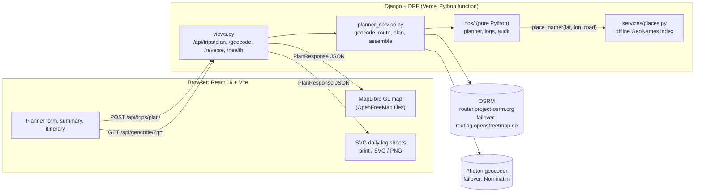

# RouteLog: ELD Trip Planner

**Enter a current location, a pickup, a drop-off and the hours already used in the cycle. RouteLog plans an FMCSA-compliant trip and returns the route map, every required stop, and a filled-out driver's daily log for each calendar day.**

- **Live app:** LIVE_URL (add `?demo=1` to open a recorded trip that needs no backend)
- **Loom walkthrough:** LOOM_URL


| Daily log sheet (day 2 of 3) | Mobile |
|---|---|
|  |  |

| Itinerary grouped by day | Turn-by-turn directions |
|---|---|
|  |  |

---

## Contents

- [Features](#features)
- [How the HOS engine works](#how-the-hos-engine-works)
- [Architecture](#architecture)
- [API reference](#api-reference)
- [Project structure](#project-structure)
- [Local setup](#local-setup)
- [Testing](#testing)
- [Deployment](#deployment)
- [Limitations and future work](#limitations-and-future-work)
- [Credits](#credits)

## Features

**Planning**
- Location autocomplete for the US and Canada, with keyboard navigation, "Use my location", and a button to swap pickup and drop-off.
- A Current Cycle Used input with a number field, a 0-70 slider, and a line showing the hours left.
- A start date and time (defaults to the next full hour), plus advanced options: pre-/post-trip inspections, whether 10-hour rests are logged as sleeper berth or off duty, and the fuel-stop length.
- Three example trips: a short haul, a cross-country run, and a trip close to the cycle limit that triggers a 34-hour restart.

**Results**
- A MapLibre map. The drive to pickup and the loaded leg are drawn in different styles. Pins mark each stop (fuel, 30-minute break, 10-hour rest, 34-hour restart, pickup, drop-off, inspections) with a popup for its time window, duration, place and mile marker. Clicking an itinerary row flies the map to that stop.
- A trip summary: total miles, driving and on-duty hours, trip length, log-sheet count, fuel stops, rests and restarts, cycle hours left at arrival, and a duty-status timeline bar for the whole trip.
- An itinerary grouped by calendar day, with per-day totals by duty status.
- **Daily Logs:** one FMCSA-style sheet per calendar day, drawn in SVG. Each sheet has the 24-hour grid and duty line, row totals that add up to 24, remarks brackets naming the city and state, and the 70-hour/8-day recap. Header fields (driver, carrier, truck and trailer numbers, shipping document) are saved in the browser. Sheets can be printed or saved as PDF (one landscape page per sheet), or downloaded as SVG or PNG.
- **Directions:** turn-by-turn steps per leg, written in English by our own generator from the OSRM maneuvers.
- The layout is responsive down to phone width. It has skeleton loading states, error messages that say what went wrong, visible focus rings and 44 px touch targets.

## How the HOS engine works

The engine is pure Python in [`backend/trips/hos/`](backend/trips/hos). It does no I/O and imports nothing from Django. It simulates the trip minute by minute in integer minutes, so every daily log adds up to exactly 1,440 minutes.

### Rules modelled

These apply to a property-carrying driver on the 70-hour/8-day cycle with no adverse driving conditions. Constants are in [`rules.py`](backend/trips/hos/rules.py). Page numbers refer to the [FMCSA *Interstate Truck Driver's Guide to Hours of Service* (April 2022)](https://www.fmcsa.dot.gov/sites/fmcsa.dot.gov/files/2022-04/FMCSA-HOS-395-DRIVERS-GUIDE-TO-HOS(2022-04-28)_0.pdf).

| Rule | Limit | How the planner handles it | Source |
|---|---|---|---|
| 11-hour driving limit | 11 h driving per duty period | Takes a 10-hour rest | p.6 |
| 14-hour window | No driving after the 14th hour since coming on duty. Off-duty time inside the window does not pause it. | Takes a 10-hour rest | p.6-7 |
| 30-minute break | A 30-minute break is required after 8 h of cumulative driving. Any 30 consecutive non-driving minutes count. | Takes a 30-minute off-duty break. Any 30 consecutive non-driving minutes (a pickup, a drop-off, a 30-minute pre-trip, or a fuel stop of 30 minutes or more) also reset the 8-hour clock. | p.6, p.10 |
| 10-hour reset | 10 consecutive hours off duty or in the sleeper berth | Resets the 11- and 14-hour clocks. Logged as sleeper berth by default. | p.6-7 |
| 70-hour/8-day cycle | No driving at or above 70 h on duty (driving plus on duty not driving) | Takes a 34-hour restart | p.10-11 |
| 34-hour restart | 34 consecutive hours off duty | Resets the cycle to 0. Logged as off duty. | p.11 |
| Fuel | At least every 1,000 miles (assessment brief) | 30 min on duty by default. If fuel is due within 75 miles, it is taken at a rest or break that is happening anyway. | brief |
| Pickup and drop-off | 1 hour each (assessment brief) | Logged on duty, not driving. Loading counts as on-duty time (p.5). | brief, p.5 |
| Inspections | Optional, on by default | 30-min pre-trip at the start of each duty period, 15-min post-trip before each rest and after drop-off. Both are on duty (p.5). | p.5 |

On-duty work after the 14th hour or past 70 hours is legal. Only driving is blocked (p.9-10), so a drop-off can always be completed.

### Planning algorithm, in brief

[`planner.py`](backend/trips/hos/planner.py) drives leg 0 (current to pickup), does the pickup, drives leg 1 (pickup to drop-off), then does the drop-off. Inside a leg, each step of `_Planner._drive_step` checks these in priority order:

1. **Cycle exhausted:** post-trip inspection, then a **34-hour restart**. Driving stops early enough that the post-trip inspection still ends within 70 hours.
2. **11 hours driven or 14-hour window closed:** post-trip inspection, then a **10-hour rest**. If fuel is due within the next 75 miles, the driver fuels at the same stop. If the rest of the trip cannot fit in the cycle and the next duty period could drive less than an hour, the planner takes a 34-hour restart instead of a rest that would unlock no useful driving.
3. **8 hours driven since the last 30-minute interruption:** a **30-minute break**. If fuel is due, or due within 75 miles, and the fuel stop lasts at least 30 minutes, the fuel stop is the break. If less than 15 minutes of driving could follow the break, the planner ends the duty period instead.
4. **1,000 miles since the last fuel:** a **fuel stop**. As with the break, if almost no driving could follow it, the fuel, post-trip and rest happen at the same stop.
5. **Otherwise, drive** until the first limit is reached: the 11-hour limit, the 14-hour window, the 8-hour break, the cycle, the fuel range, or the end of the leg.

Each stop is placed at the exact point along the real OSRM route where its limit is reached. `LegProfile` ([`profile.py`](backend/trips/hos/profile.py)) interpolates distance, time and coordinates from OSRM's per-segment annotations. Speeds are capped at 65 mph for a truck. [`logs.py`](backend/trips/hos/logs.py) then splits the events at midnight into daily sheets. It merges duty segments, rounds row totals with a largest-remainder method so they sum to exactly 24.00, writes remarks named from an offline place index ("I 44 near Joplin, MO"), and fills in the 70-hour recap.

### Assumptions

The API returns these in `assumptions[]` and the UI lists them.

- The driver starts rested (at least 10 h off): the 11- and 14-hour clocks are fresh.
- The driver is off duty from midnight until the trip starts, and from the trip end until midnight.
- The tank is full at the current location.
- **Cycle hours do not roll off during the trip.** The input is one number with no per-day history, so the planner assumes none of it drops off. This is conservative: it may take a restart slightly earlier than a full log history would require (p.10-11).
- All times are the home-terminal time of the start location, with no time-zone conversion (logs are kept in home-terminal time, p.16).
- One driver: no team driving and no split sleeper berth.
- Truck speed is at most 65 mph on any route segment.

## Architecture



- **Stateless API.** There are no models and no database. One plan request makes at most three geocoding calls (run in parallel) and one OSRM call with three waypoints, which returns both legs. Every upstream call shares a time budget (`PLAN_TIME_BUDGET_SECONDS`, 25 s by default).
- **Place names in remarks never hit the network.** `places.csv.gz` is about 23,000 US and Canadian populated places from GeoNames, loaded into a 1° grid index. Stops are labelled in log-remark style ("Joliet, IL", "I 80 near Joliet, IL") without calling a rate-limited reverse geocoder.
- **One JSON contract.** [`frontend/src/types/api.ts`](frontend/src/types/api.ts) defines the response shape. The backend emits exactly those snake_case keys, and a contract test checks this.
- **Offline demo.** `?demo=1` (Chicago → St. Louis → Dallas, 2 sheets) and `?demo=restart` (Seattle → Denver → Houston at 60 h used, with a 34-hour restart) replay responses recorded from the live backend through a lazily loaded mock client.

## API reference

All endpoints live under `/api/`. The trailing slash is optional. Every error has the same shape: `{"error": "<message>", "code": "<code>", "details"?: {"<field>": ["..."]}}`.

### `POST /api/trips/plan/`

Request (each location takes either `lat`/`lon` or a free-text `query`; `options` is optional):

```json
{
  "current_location": { "label": "Chicago, IL", "lat": 41.8781, "lon": -87.6298 },
  "pickup_location":  { "query": "St. Louis, MO" },
  "dropoff_location": { "query": "Dallas, TX" },
  "current_cycle_used_hours": 10,
  "start_time": "2026-09-21T06:00",
  "options": { "include_inspections": true, "rest_status": "SB", "fuel_stop_minutes": 30 }
}
```

Response (`PlanResponse`, abridged):

```jsonc
{
  "input":    { "current_location": { "label": "Chicago, IL", "lat": 41.8781, "lon": -87.6298 }, "...": "..." },
  "route":    { "distance_miles": 925.7, "duration_hours": 17.38, "geometry": [[-87.62977, 41.8781], "..."],
                "legs": [{ "from_role": "current", "to_role": "pickup", "distance_miles": 296.6,
                           "instructions": [{ "text": "Head south on South Federal Street", "maneuver": "depart", "...": "..." }] }],
                "provider": "OSRM (router.project-osrm.org)" },
  "timeline": [{ "id": "e1", "kind": "pre_trip", "status": "ON", "label": "Pre-trip inspection",
                 "start": "2026-09-21T06:00", "end": "2026-09-21T06:30", "duration_hours": 0.5,
                 "miles": 0.0, "start_mile": 0.0, "end_mile": 0.0, "leg_index": 0,
                 "start_location": { "lat": 41.8781, "lon": -87.62977, "name": "Chicago, IL" }, "...": "..." }],
  "stops":    [{ "id": "e3", "kind": "pickup", "status": "ON", "label": "Pickup (loading)",
                 "start": "2026-09-21T12:07", "end": "2026-09-21T13:07", "mile_marker": 296.6, "day_number": 1, "...": "..." }],
  "daily_logs": [{ "date": "2026-09-21", "day_number": 1, "total_miles": 588.7,
                   "segments": [{ "status": "OFF", "start_minute": 0, "end_minute": 360 }, "..."],
                   "totals": { "OFF": 6.0, "SB": 5.25, "D": 11.0, "ON": 1.75 },
                   "remarks": [{ "start_minute": 727, "end_minute": 787, "status": "ON", "location": "St. Louis, MO", "note": "Pickup" }],
                   "on_duty_hours": 12.75, "cycle_hours_used": 22.75, "cycle_hours_available": 47.25,
                   "from_location": "Chicago, IL", "to_location": "Joplin, MO" }],
  "summary":  { "total_miles": 925.7, "total_driving_hours": 17.38, "num_days": 2, "num_rests": 1,
                "num_restarts": 0, "cycle_hours_available_at_end": 39.12, "...": "..." },
  "assumptions": ["The driver starts the trip rested (at least 10 hours off), ...", "..."],
  "warnings": []
}
```

| Status | `code` | When |
|---|---|---|
| 400 | `validation_error` | Cycle hours outside 0-70, a bad `start_time` (use `YYYY-MM-DDTHH:MM`), or a location with neither coordinates nor a query |
| 422 | `geocode_failed` | A free-text location has no US or Canadian match |
| 422 | `route_not_found` | OSRM cannot connect the points (for example, across an ocean) |
| 502 | `upstream_unavailable` | Both OSRM hosts failed or the time budget ran out |

### `GET /api/geocode/?q=joliet`

Autocomplete, restricted to the US and Canada. `q` needs at least 2 characters; `limit` is optional (1-10, default 6). Results are cached in memory and sent with `Cache-Control: public, max-age=3600`.

```json
{ "results": [{ "label": "Joliet, Illinois, United States", "short_label": "Joliet, IL", "lat": 41.525, "lon": -88.0817 }] }
```

### `GET /api/reverse/?lat=41.52&lon=-88.08`

The nearest populated place from the offline dataset. Used by "Use my location". Returns `{"result": GeocodeResult | null}`.

### `GET /api/health/`

Returns `{"status": "ok"}`.

## Project structure

```
eld-trip-planner/
├── backend/                     Django 6.1 + DRF, managed with uv
│   ├── config/                  settings (env-driven), urls, wsgi (Vercel entrypoint)
│   ├── trips/
│   │   ├── hos/                 pure-Python HOS engine
│   │   │   ├── rules.py         limits and durations, with FMCSA page cites
│   │   │   ├── profile.py       LegProfile: mile/minute/coordinate interpolation along a leg
│   │   │   ├── planner.py       duty-status state machine (plan_events)
│   │   │   ├── logs.py          timeline, stops, daily logs, summary (build_plan)
│   │   │   └── audit.py         independent compliance checker used by the tests
│   │   ├── services/            OSRM routing, Photon/Nominatim geocoding, offline places,
│   │   │                        instruction text, polyline simplification, TTL cache
│   │   ├── data/places.csv.gz   GeoNames US/CA populated places
│   │   ├── planner_service.py   geocode → route → engine → PlanResponse
│   │   ├── serializers.py       request validation
│   │   ├── views.py             endpoints and ApiError handler
│   │   └── tests/               pytest + Hypothesis
│   ├── scripts/build_places.py  rebuilds places.csv.gz from GeoNames
│   └── vercel.json
├── frontend/                    Vite 8 + React 19 + TypeScript + Tailwind v4
│   ├── src/
│   │   ├── types/api.ts         shared JSON contract
│   │   ├── lib/api.ts           typed fetch client
│   │   ├── components/
│   │   │   ├── planner/         form, location combobox, cycle input, examples
│   │   │   ├── map/             MapLibre map, markers, legend, popups
│   │   │   ├── summary/         stat tiles, duty timeline bar
│   │   │   ├── results/         itinerary, directions, tabs
│   │   │   └── logsheet/        FMCSA log sheet SVG, print and export
│   │   └── mocks/               recorded live responses for ?demo=
│   └── vercel.json
└── docs/
    ├── SPEC.md                  build spec and engine interface
    ├── LOOM_SCRIPT.md           talk track for the walkthrough video
    └── screenshots/
```

## Local setup

You need Python 3.12+ with [uv](https://docs.astral.sh/uv/), and Node 20.19+ or 22.12+ (required by Vite 8).

```bash
# Backend: http://127.0.0.1:8000
cd backend
uv sync
uv run python manage.py runserver 8000

# Frontend: http://localhost:5173 (the dev server proxies /api to 127.0.0.1:8000)
cd frontend
npm install
npm run dev
```

No API keys are needed. Every external service is free and public. To look at the UI without the backend, open `http://localhost:5173/?demo=1` or `?demo=restart`.

Environment variables are documented in [`backend/.env.example`](backend/.env.example) and [`frontend/.env.example`](frontend/.env.example). The local defaults work as they are.

## Testing

```bash
cd backend
uv run pytest            # about 200 tests, offline (recorded OSRM fixtures)
uv run pytest -m live    # optional smoke test against the real OSRM + Photon

cd frontend
npm run build            # tsc type-check + production build
npm run lint             # oxlint
```

Accuracy is enforced in three layers:

1. **Hand-calculated scenarios** (`test_hos_scenarios.py`). Each checks exact event sequences and times: a same-day short trip, exactly 11 hours of driving, the 14-hour window binding before the 11-hour limit, a 34-hour restart at 65 h used, starting at 70 h, current location equal to pickup, a fuel stop that lands exactly on a leg end, a trip that ends at midnight, and a 2,500-mile multi-day run.
2. **An independent auditor** ([`hos/audit.py`](backend/trips/hos/audit.py)). It reads only the finished event list and re-derives every clock from the FMCSA rules. It shares no state with the planner, so a planner bug cannot hide behind the planner's own bookkeeping. It checks the 11-hour, 14-hour, 8-hour/30-minute, 70-hour and 1,000-mile limits, event contiguity, and 60-minute pickup and drop-off. `audit_plan` checks every daily log: segments cover 0-1440, totals sum to 24.00 and match the segments, and per-day miles add up to the route total.
3. **Property-based tests** (`test_hos_properties.py`, Hypothesis). Hundreds of random trips per run: legs from 0 to 3,500 miles, polylines with mixed city and highway speeds, cycle hours from 0 to 70 (with the 65, 69.5 and 70 edge cases), random start times, and every option combination. Each plan must pass the auditor. The tests also assert there are no premature stops: a break, rest or restart appears only when a limit actually binds.

Contract tests validate the engine output against `api.ts`. Service tests run a recorded Chicago → St. Louis → Dallas OSRM response through the whole pipeline, and API tests cover validation and every error code.

## Deployment

The app deploys as two Vercel projects from the same repository. The browser only talks to the frontend domain, and the frontend proxies `/api/*` to Django, so no CORS setup is needed.

**1. Backend (`backend/`).** Vercel detects Django from `manage.py` and serves `config.wsgi` as a single Python function. [`backend/vercel.json`](backend/vercel.json) sets `maxDuration` to 60 s, above the 25 s planning budget, and pins `trips/data/**` into the bundle.

```bash
cd backend
vercel link                                   # new project, root = backend/
vercel env add DJANGO_SECRET_KEY production   # long random string
vercel --prod
curl https://<backend>.vercel.app/api/health/ # {"status":"ok"}
```

`DJANGO_DEBUG` defaults to off (only local `manage.py` commands turn it on), and `DJANGO_SECRET_KEY` is required when it is off. `ALLOWED_HOSTS` already includes `.vercel.app`; set it only for a custom domain.

**2. Frontend (`frontend/`).** A static Vite build. [`frontend/vercel.json`](frontend/vercel.json) rewrites `/api/:path*` to the backend and sends everything else to `index.html`. Replace the `__BACKEND_URL__` placeholder with the backend origin before deploying:

```bash
cd frontend
sed -i '' 's#__BACKEND_URL__#https://<backend>.vercel.app#' vercel.json   # GNU sed: sed -i
vercel link                                   # new project, root = frontend/
vercel --prod
curl https://<frontend>.vercel.app/api/health/  # proxied to Django
```

Alternatively, set `VITE_API_BASE_URL=https://<backend>.vercel.app` at build time and add the frontend origin to the backend's `CORS_ALLOWED_ORIGINS`.

## Limitations and future work

- **Rolling 70-hour/8-day recap.** The brief gives one "cycle used" number, so hours never roll off during the trip. This is conservative. With a per-day history of the last 7 days, the engine could drop the oldest day at each midnight and often avoid a restart.
- **Time zones.** Logs use home-terminal time throughout, as the FMCSA requires (p.16). The UI does not show local arrival times when a trip crosses zones.
- **Split sleeper berth** (7/3 or 8/2 pairing, p.7-9) and team driving are not modelled. Both could shorten long trips.
- **Truck-specific routing.** OSRM uses a car profile with a 65 mph cap. A truck router (height, weight and hazmat restrictions, truck-legal roads) and real truck-stop locations for fuel and rest would make the plan more realistic.
- **Adverse driving conditions** and short-haul exceptions (p.12-14) are out of scope, as the brief specifies.
- The free public OSRM and Photon servers have no SLA. The backend fails over to a second host, and production traffic would warrant a self-hosted instance.

## Credits

- Map data © [OpenStreetMap](https://www.openstreetmap.org/copyright) contributors
- Routing: [OSRM](https://project-osrm.org/) (public demo server and [FOSSGIS routing.openstreetmap.de](https://routing.openstreetmap.de/))
- Geocoding: [Photon](https://photon.komoot.io/) by komoot, with [Nominatim](https://nominatim.org/) as a fallback
- Map tiles: [OpenFreeMap](https://openfreemap.org/) and [OpenMapTiles](https://openmaptiles.org/), rendered with [MapLibre GL JS](https://maplibre.org/)
- Place names: [GeoNames](https://www.geonames.org/) (CC BY 4.0)
- HOS rules: FMCSA, [*Interstate Truck Driver's Guide to Hours of Service*](https://www.fmcsa.dot.gov/sites/fmcsa.dot.gov/files/2022-04/FMCSA-HOS-395-DRIVERS-GUIDE-TO-HOS(2022-04-28)_0.pdf) (2022)

Released under the [MIT License](LICENSE).
